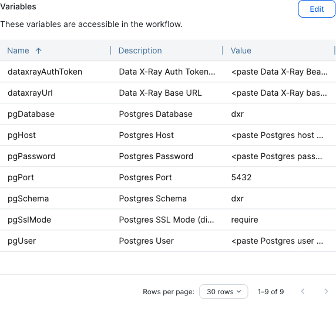

# Deploying the Data X-Ray → Postgres mirror in Collibra

**Sync Data X-Ray Files to Postgres (Nightly)** is a single Collibra workflow that
copies every file Data X-Ray has indexed into one Postgres schema (default `dxr`),
every night at **03:00** (Collibra server time). It is self-contained: it does
**not** require the Data X-Ray ↔ Collibra workflow bundle (search, classification
sync, file import) and shares nothing with it except the Data X-Ray token.

This guide is for the **Collibra UI** — no command-line tools are required. You
are given one Workflow Designer ZIP, `sync-data-xray-files-postgres.zip`.

## What it produces

- `dxr.files` — one row per file (`file_id` primary key) with the fixed columns
  (`datasource_name`, `file_name`, `path`, `size`, `mime_type`, `created_at`,
  `last_modified_at`, `owner_name`, `who_can_access`, …) **plus one column per
  Data X-Ray classification**, named `"{classification uuid}_{name}"` (lower
  snake case, truncated to Postgres's 63-character identifier limit):
  labels → `boolean`, annotators and annotator domains → `integer` (number of
  unique matched phrases; `NULL` = not evaluated), extractors → `text`. External
  metadata fields get `"external_{field}"` columns.
- `dxr.classifications`, `dxr.metadata_fields`, `dxr.datasources` — reference
  tables (including which `files` column each classification owns).
- `dxr.sync_runs` — one row per run with counts and any error.

Files that Data X-Ray no longer returns are **deleted** from `dxr.files` (a run
that receives zero files skips the delete, so an outage never empties the table).

## Prerequisites

| # | Prerequisite | Why / how to check |
|---|---|---|
| 1 | **On-premise (self-hosted) Collibra**, any version with the v2 workflow API (tested against 2026.08 / 32.x). | The workflow opens a plain JDBC connection with the PostgreSQL driver that ships inside Collibra. **Collibra Cloud cannot run it**: its outbound proxy only allows HTTP(S) and a Postgres connection times out. (A Cloud instance will still *import* it fine — useful as a validation check.) |
| 2 | **Network path** Collibra server → Postgres host on the Postgres port (default 5432). | From the Collibra host: `nc -vz <pg-host> 5432` (or `psql -h <pg-host> …`). Open the firewall / security group if needed. |
| 3 | **PostgreSQL 12 or newer** (tested on 16), reachable as above. | `SELECT version();` |
| 4 | A **database** and a **login role** for the sync, allowed to create a schema in that database. | `CREATE DATABASE dxr; CREATE ROLE dxr_sync LOGIN PASSWORD '…'; GRANT CREATE, CONNECT ON DATABASE dxr TO dxr_sync;` — the workflow creates and evolves all tables itself; nothing else to prepare. |
| 5 | **Disk**: ~1 KB per file plus the classification columns; 100k files ≈ 150–250 MB including indexes. | Allow headroom for the staging table (a second copy during each run). |
| 6 | **TLS**: if the Postgres server does not offer SSL, you must set **Postgres SSL Mode** to `disable`. `require` (default) encrypts without verifying the certificate; `verify-full` also needs the server certificate to be trusted by Collibra's JVM. | `SHOW ssl;` on the server. |
| 7 | A **Data X-Ray user API token** (Bearer) whose user may see **all** datasources — the mirror only contains what the token can see. | Create it in Data X-Ray under the user's API tokens. |
| 8 | A Collibra account with the **Sysadmin** global role or a global role that includes the **Workflow Administration** permission, to import, enable and configure the workflow. | |

## Step 1 — Import the workflow

1. Open **Settings**: click the **Products** icon (☰), then the **cogwheel** (⚙️).
2. Go to **Workflows → Definitions**.
3. Click **Upload a file** (or drag-and-drop `sync-data-xray-files-postgres.zip` onto the page).
4. Wait for the progress bar to finish.

> Re-importing a workflow with the same process ID **replaces** the existing one
> in place and keeps its variables and start roles. **Deleting** it and importing
> again resets both.

## Step 2 — Enable it

Newly imported workflows are **disabled** by default, and a disabled workflow's
overview page renders blank. In **Workflows → Definitions**, find the row and
click the **play** icon (▶) at the end of it.

## Step 3 — Set the variables

Open the workflow definition, then **Variables → edit**, and fill in:

| Variable | Value |
|---|---|
| Data X-Ray Base URL | `https://<your-dxr-host>` (no trailing slash) |
| Data X-Ray Auth Token (Bearer) | the API token from prerequisite 7 |
| Postgres Host | hostname or IP of the Postgres server |
| Postgres Port | `5432` unless changed |
| Postgres Database | `dxr` (or the database from prerequisite 4) |
| Postgres Schema | `dxr` — the schema the workflow creates and owns |
| Postgres User / Password | the role from prerequisite 4 |
| Postgres SSL Mode | `require` (default), `verify-full`, or `disable` |

Until real values are entered each field shows a `<paste … here>` placeholder;
a run with any placeholder still in place is skipped and logged, never fails.
The panel looks like this (Collibra 2026.08):



The token and the database password are hidden configuration variables — only
Sysadmins / Workflow Administrators can see or change them.

## Step 4 — Decide who may start it manually

The workflow runs on a **timer**, so start roles only control who can trigger it
*by hand* (from the UI or the REST API). A fresh import has **no restriction**.
To limit it, open the workflow definition → **Settings** (or the **Start roles**
section, depending on your Collibra version) and pick the roles allowed to start
it — typically **Sysadmin**. If the Data X-Ray ↔ Collibra workflow bundle is also
installed, its **Data X-Ray Admin** role is a natural choice; nothing in this
workflow depends on that bundle.

## Step 5 — First run and verification

Don't wait for 03:00. Start it once by hand — from the workflow definition page,
or via the REST API:

`POST /rest/2.0/workflowInstances` with body
`{"workflowDefinitionId": "<definition id>", "sendNotification": false}`
(the id is in the workflow's URL). Then in Postgres:

```sql
SELECT * FROM dxr.sync_runs ORDER BY id DESC LIMIT 1;   -- status ok, files_seen = number of files in Data X-Ray
SELECT count(*) FROM dxr.files;
SELECT column_name FROM dxr.classifications;             -- one column per classification
```

A full run of ~100k files takes about 1½ minutes; progress is logged to
`dgc.log` every 20,000 rows (`Postgres file sync run N: …`).

From then on the timer fires at **03:00** server time. Check `dxr.sync_runs`
(one row per night) or `dgc.log` if a night looks off.

## Operations notes

- **Upgrading** the workflow (re-import, same process id) keeps the variables and
  the start roles. **Deleting** it resets both — re-enter them.
- **Schema changes are automatic**: new classifications become new columns, a
  classification renamed in Data X-Ray gets its column renamed (the uuid prefix is
  the identity), new `external` metadata fields become `external_…` columns.
  Columns are never dropped; a classification deleted in Data X-Ray simply stops
  being populated (see `dxr.classifications.last_seen_run`).
- **Failures never delete data**: if Data X-Ray is unreachable or returns zero
  files, the run ends with `status = failed` / `empty`, existing rows stay, and
  the next night retries. Three consecutive stream attempts are made per run.
- **Changing the target schema/database** later: set the new values and run
  once — the workflow bootstraps the new schema; drop the old one by hand.
